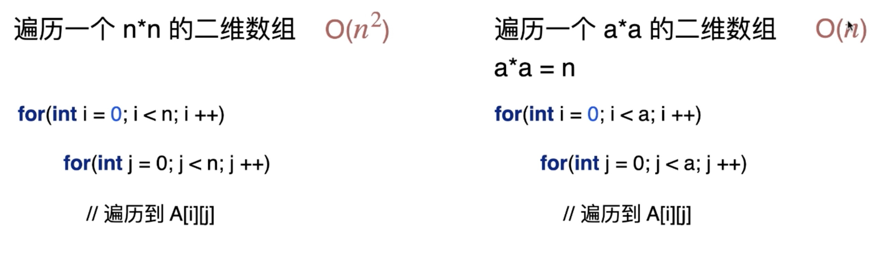

# 线性查找法

## 什么是算法

算法是解决问题的方法。它有 5 个特点:

1. 有限性（时间、空间）
2. 确定性（没有二义性）
3. 可行性（如获取最大的数，这是不可行的）
4. 输入
5. 输出

## 线性查找法

线性查找算法的演进：

1. 基础的 for 循环，一个个元素进行查找
2. 支持比较不同数据类型
3. 支持自定义比较函数

## 循环不变量

```js
function LinearSearch(data, item){
  for(let i = 0; i < data.length; i++) {
    if(data[i] === item) {
      return i
    }
  }
  return -1
}
```

- 循环不变量：arr[0, i-1] 中没有找到目标
- 循环体的作用，是用来维护循环不变量

**写出正确的代码**

- 定义清楚循环不变量
- 维护循环不变量
- 定义清楚函数的功能（输入、输出）
  - LinearSearch
    - 输入: 数组、目标元素
    - 输出：目标元素存在的索引；若不存在，返回 -1

## 复杂度分析

复杂度分析：表示算法的性能。

通常查看最差的情况，算法运行的上界。

```js
function LinearSearch(data, item){
  for(let i = 0; i < data.length; i++) {
    if(data[i] === item) {
      return i
    }
  }
  return -1
}
```

- n 表示数据规模，data.length
- T 表示指令运行次数。T=5n+2? 单位 ms，这个还和具体机器有关
- 大 O 表示法
  - 常数不重要，复杂度描述的是随着数据规模的增大，算法性能的变化趋势

```js
T1 = 10000n  O(n)
T2 = 2n^2    O(n^2)
```

存在临界点 n0= 5000， 当 n > n0 时， T2 > T1。

## 常见的时间复杂度


