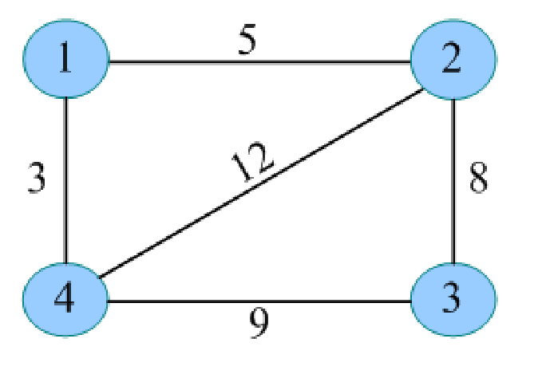
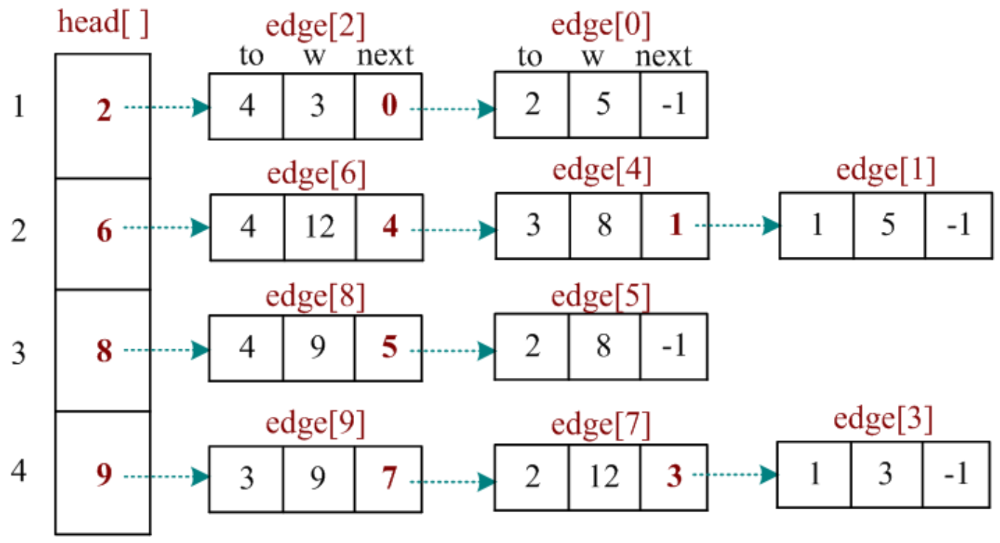
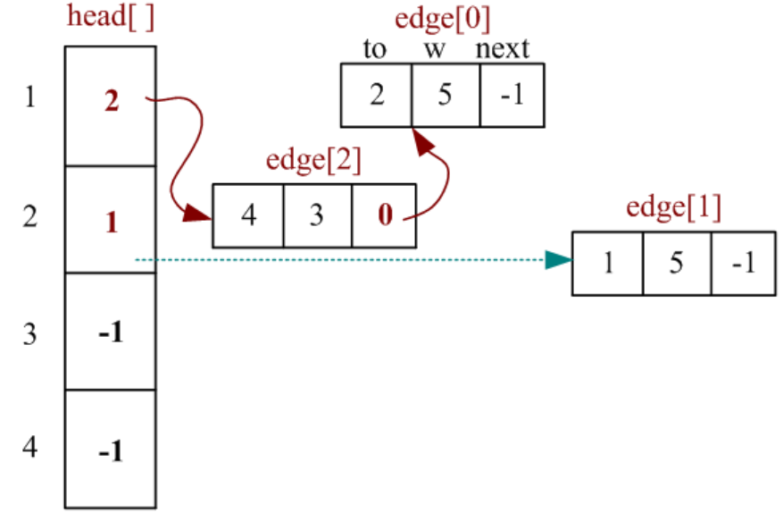
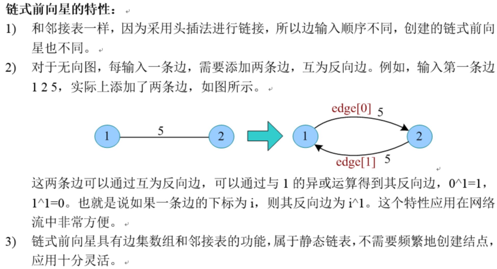

# 链式前向星

## 概念

链式前向星是邻接表的一种改进一静态链表存储，它用边集数组和邻接表相结合，可以快速找到某个点的所有邻接点。

链式前向星的数据结构定义如下：

```
边集数组 edge[i]  // 存储索引为 i 的边
头结点数组 head[i]  // 存储以 i 为起点的第一条边的下标(在 edge[] 中的下标)
```

```
// 边集数组
struct node {
  int to;  // 终点编号
  int w;  // 该边的权重
  int next;  // 该边的下一条边的下标
}edge(M)  // M 为边的数量
// 头结点数组
int head[N]  // N 为点的数量
```





## 如何访问节点 v 的所有邻接点？

```ts
for (let i = head[v]; i != -1; i = edge[i].next) {
  // edge[i].to 为节点 v 的邻接点
  // edge[i].w 为节点 v 到节点 edge[i].to 的权重
  // edge[i].next 为节点 v 的下一条边的下标
}
```

## 添加边

```ts
function addEdge(u, v, w) {
  edge[cnt].to = v; // 终点编号
  edge[cnt].w = w; // 权重
  edge[cnt].next = head[u]; // 该边的下一条边的下标
  head[u] = cnt; // 以 u 为起点的第一条边的下标
  cnt++;
}
```


(头插法)

对于无向图, 需要 addEdge(u, v, w) 和 addEdge(v, u, w) 两次。对于有向图，只需要 addEdge(u, v, w) 一次。

注意：

- 初始化 head 数组为 -1，表示该点没有边。
- 为了方便，可以将 head 数组的下标从 1 开始，这样就不需要 -1 了。也就是节点的编号从 1 开始。
- 边集数组从索引 0 开始的好处是，方便查找互补边。如 `3^1 -> 4`，`4^1 -> 3`。


## 时间复杂度

- 访问一个节点 v 的所有邻接点的时间复杂度为 O(degree(v))
- 访问所有节点的邻接点 O(N + E)


