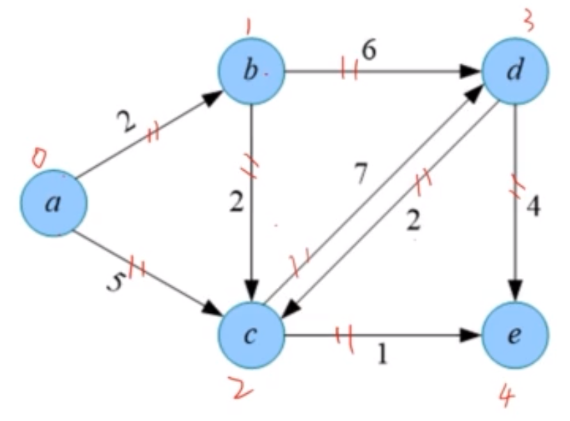
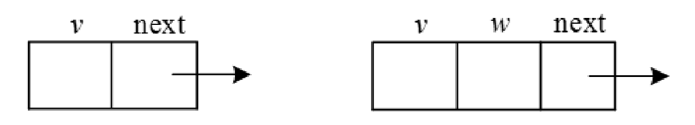
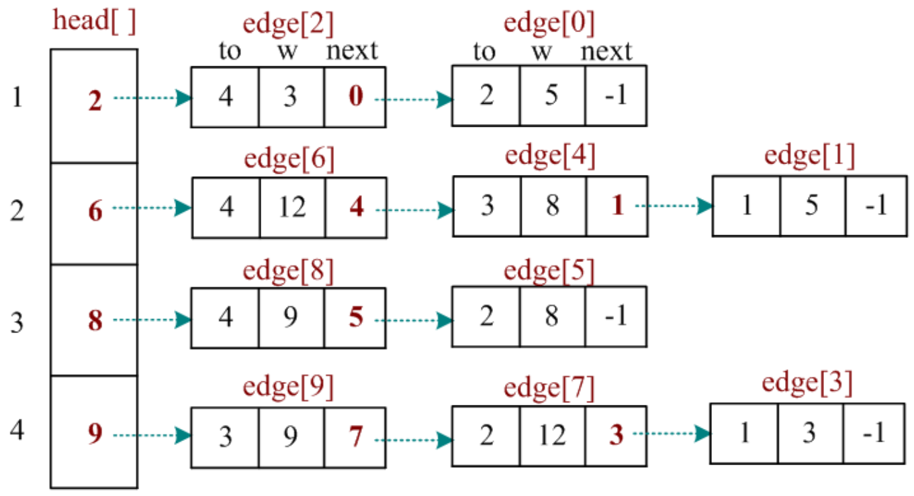

# 图的存储

## 邻接矩阵

邻接矩阵是表示顶点之间关系的矩阵。

邻接矩阵存储方法：

1. 一个一维数组存储图中顶点的信息。
2. 一个二维数组存储图中顶点之间的邻接关系。

存储顶点之间邻接关系的二维数组称为邻接矩阵。

> 通常会将节点 a 转换为下标 i，节点 b 转换为下标j，那么 M[i][j] 就表示 a 到 b 的边。可以用 Map 来存储节点和下标的对应关系。

在无向图中，如果 $v_i$ 到 $v_j$ 有边，则邻接矩阵 M[i][j]=M[j][i]=1，否则 M[i][j]=0。


在有向图中，如果 $v_i$ 到 $v_j$ 有边，则邻接矩阵 M[i][j]=1，否则 M[i][j]=0。


在带权图中，如果 $v_i$ 到 $v_j$ 有边，则邻接矩阵 M[i][j]= $w_i$$_j$ ，否则 M[i][j]= ∞。


优点：

- 快速判断两顶点之间是否有边。
- 方便计算各顶点的度。
  - 无向图：对应行的元素之和。
  - 有向图：对应行的元素之和为出度，对应列的元素之和为入度。

缺点：

- 不便于增删顶点。
- 不便于访问所有邻接点。
- 间复杂度高。


## 边集数组

边集数组表示法，通过数组存储每条边的起点和终点。如果是网，则增加一个权值域。

网的边集数组数据结构定义如下：

```ts
struct Edge {
  int u, v, w;
}e(N*N) // 每个点最多有 N-1 条边
```



如果 u 和 v 不是 int 类型，可以将 u 和 v 替换为索引。如 `a -> 0, b -> 1, c -> 2, d -> 3, e -> 4`。

边集数组存储如下：

| 边数组 | u   | v   | w   |
| ------ | --- | --- | --- |
| 0      | 0   | 1   | 2   |
| 1      | 0   | 2   | 5   |
| 2      | 1   | 2   | 2   |
| 3      | 1   | 3   | 6   |
| 4      | 2   | 3   | 7   |
| 5      | 2   | 4   | 1   |
| 6      | 3   | 2   | 2   |
| 7      | 3   | 4   | 4   |

找某条边的顶点或权重：

```
E[2].u
E[2].v
E[2].w
```

优点：
- 可以对边按照权值进行排序
- 方便对边进行处理

缺点：
- 不便于判断两个点之间是否有边
- 不便于遍历所有的邻接点
- 不便于求某个点的入度和出度

## 邻接表

邻接表是图的一种链式存储方法。邻接表包含两部分：顶点和邻接点。

- 顶点：包括顶点信息和指向第一个邻接点的指针。
- 邻接点：包括邻接点的存储下标和指向下一个邻接点的指针。

顶点 $v_i$ 的所有邻接点构成一个单链表。

> 也可以不用单链表，而是用数组来存储邻接点。

### 无向图的邻接表


### 有向图的邻接表


邻接表的数据结构包括节点和邻接点，对其分别定义如下。

1. 节点。包括节点信息data和指向第1个邻接点的指针first。


2. 邻接点。包括该邻接点的存储下标v和指向下一个邻接点的指针next，如果是网的邻接点，则还需增加一个权值域w。



### 优缺点

优点：

-	便于增删顶点。
-	便于访问所有邻接点。
-	空间复杂度低。

缺点：

-	不便于判断两顶点之间是否有边。
-	不便于计算各顶点的度。

虽然以邻接表访问单条边的效率不高，但是访问同一节点的所有关联边时，仅需访问该节点后面的单链表，时间复杂度为该节点的度O(d(vi))；而以邻接矩阵访问同一节点的所有关联边时，时间复杂度为O(n)。总体上，邻接表比邻接矩阵效率更高。

## 链式前向星

### 概念

链式前向星是邻接表的一种改进（静态链表存储），它用边集数组和邻接表相结合，可以快速找到某个点的所有邻接点。

> `静态`是指不是存储的指针，而是存储的下标。

链式前向星的数据结构定义如下：

```
边集数组 edge[i]  // 存储索引为 i 的边
头结点数组 head[i]  // 存储以 i 为起点的第一条边的下标(在 edge[] 中的下标)
```

```
// 边集数组
struct node {
  int to;  // 终点编号
  int w;  // 该边的权重
  int next;  // 该边的下一条边的下标
}edge(M)  // M 为边的数量
// 头结点数组
int head[N]  // N 为点的数量
```





### 如何访问节点 v 的所有邻接点？

```ts
for (let i = head[v]; i != -1; i = edge[i].next) {
  // edge[i].to 为节点 v 的邻接点
  // edge[i].w 为节点 v 到节点 edge[i].to 的权重
  // edge[i].next 为节点 v 的下一条边的下标
}
```

### 添加边

```ts
function addEdge(u, v, w) {
  edge[cnt].to = v; // 终点编号
  edge[cnt].w = w; // 权重
  edge[cnt].next = head[u]; // 该边的下一条边的下标
  head[u] = cnt; // 以 u 为起点的第一条边的下标
  cnt++;
}
```


(头插法)

对于无向图, 需要 addEdge(u, v, w) 和 addEdge(v, u, w) 两次。对于有向图，只需要 addEdge(u, v, w) 一次。

注意：

- 初始化 head 数组为 -1，表示该点没有边。
- 为了方便，可以将 head 数组的下标从 1 开始，这样就不需要 -1 了。也就是节点的编号从 1 开始。
- 边集数组从索引 0 开始的好处是，方便查找互补边。如 `3^1 -> 4`，`4^1 -> 3`。


### 时间复杂度

- 访问一个节点 v 的所有邻接点的时间复杂度为 O(degree(v))
- 访问所有节点的邻接点 O(N + E)


