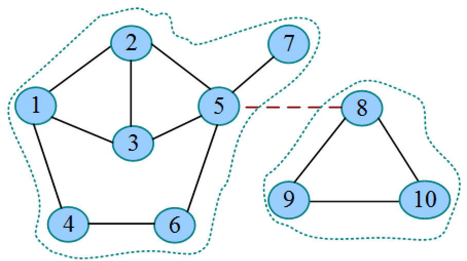

## 桥与割点

## 连通分量

在无向图中，如果从节点 vi 到节点 vj 有路径，则称节点 vi 和节点 vj 是连通的。如果图中任意两个节点都是连通的，则称图 G 为连通图。

无向图 G 的极大连通子图被称为图 G 的连通分量。极大连通子图是图 G 连通子图，如果再向其中加入一个节点，则该子图不连通。

> 当一个连通子图中加入任何一个节点都会使得其不再连通时，这个连通子图就是极大连通子图。

**下图中有几个连通分量？**

非连通图才有多个连通分量。连通图只有一个连通分量。

## 强连通分量

在有向图中，如果图中的任意两个节点从 vi 到 vj 都有路径，且从 vj 到 vi 也有路径，则称图G为强连通图。

有向图 G 的极大强连通子图被称为图 G 的强连通分量。极大强连通子图是图 G 的强连通子图，如果再向其中加入一个节点，则该子图不再是强连通的。

**下图中有几个强连通图？**

]

## 桥与割点

如果去掉无向连通图 G 中的一条边 e，图 G 分裂为两个不相连的子图，那么 e 为图 G 的桥或割边。

如果去掉无向连通图G中的一个点v及v关联的所有边，图G分裂为两个或两个以上不相连的子图，那么v为图G的割点。

## 如何求解桥和割点？

首先引入时间戳和追溯点的概念。

- 时间戳：dfn[u] 表示节点 u 的深度优先遍历序号。
- 追溯点：low[u] 表示节点 u 或 u 的子孙能通过非父子边追溯到的 dfn 最小值，即回到最早的过去。

初始时，dfn[u]=low[u]，如果该节点的邻接点未被访问，则一直进行深度优先遍历。回归更新路径上所有祖先节点的low值，因为子孙能回到的追溯点，其祖先也能回到。

**桥判定法则**：无向边 x-y 是桥，当且仅当在搜索树上存在 x 的一个子节点 y 时，满足low[y]>dfn[x]。

也就是说，若孩子的low值比自己的dfn值大，则从该节点到这个孩子的边为桥。

**割点判定法则**：若x不是根节点，则x是割点，当且仅当在搜索树上存在x的一个子节点y，满足low[y]≥dfn[x]；若x是根节点，则x是割点，当且仅当在搜索树上至少存在两个子节点，满足该条件。

