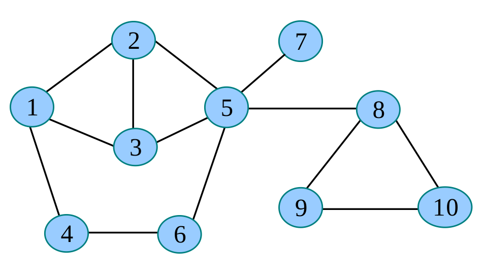
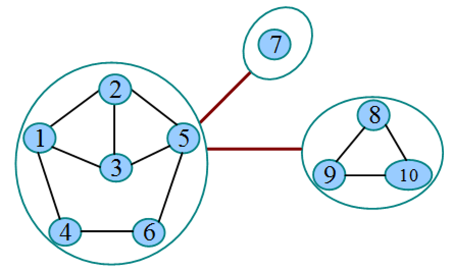
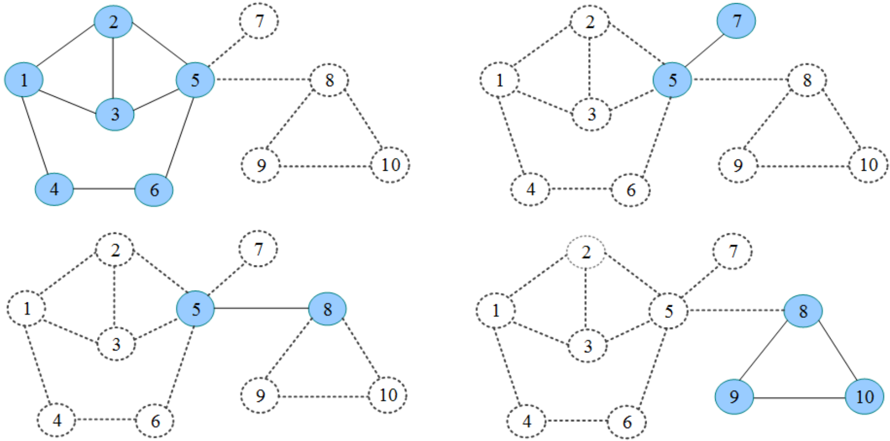
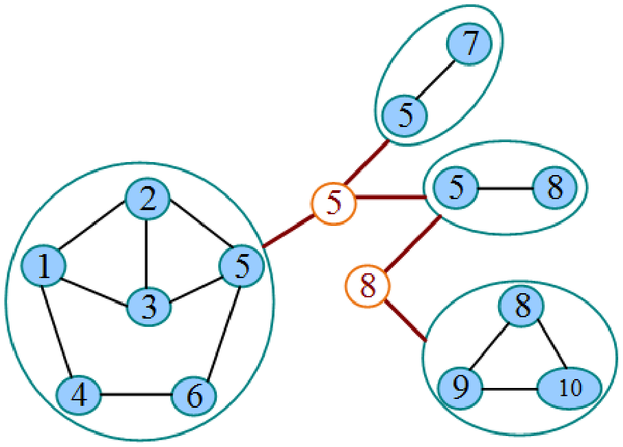

# 连通分量与缩点

## 双连通分量

如果在无向图中不存在桥，则称它为边双连通图。如果在无向图中不存在割点，则称它为点双连通图。

无向图的极大边双连通子图被称为边双连通分量，记为e-DCC。无向图的极大点双连通子图被称为点双连通分量，记为v-DCC。二者被统称为双连通分量DCC。

## 双连通分量缩点

把每一个边双连通分量e-DCC都看作一个点，把桥看作连接两个缩点的无向边，可得到一棵树，称为e-DCC缩点。

把每一个点双连通分量v-DCC都看作一个点，把割点看作一个点，每个割点都向包含它的v-DCC连接一条边，得到一棵树，称为v-DCC缩点。

在图G中有两个割点（5和8）及4个点双连通分量。

把割点看作一个点，每个割点都向包含它的点双连通分量连接一条边，得到一棵树，称为v-DCC缩点。

