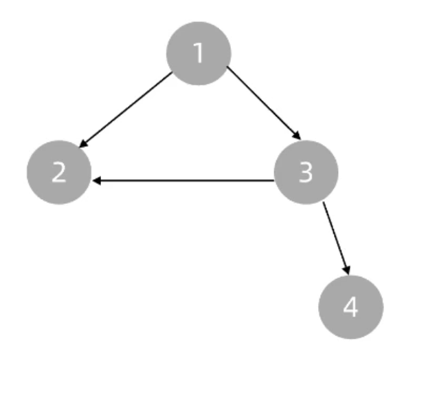
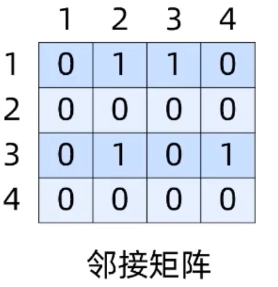
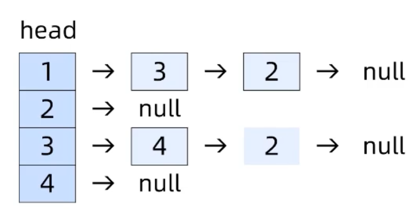
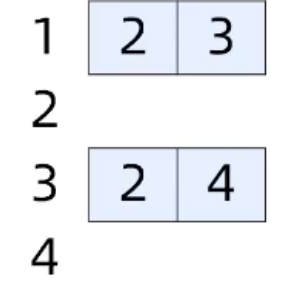
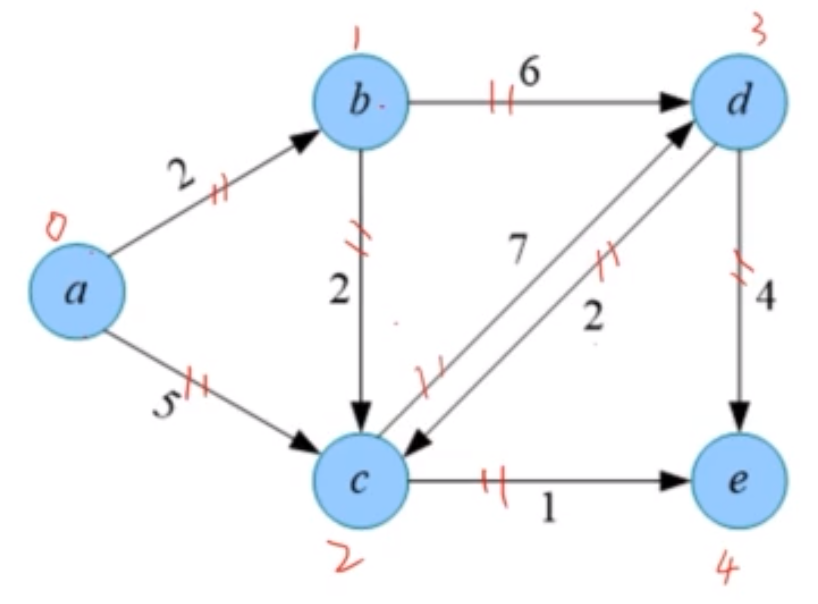
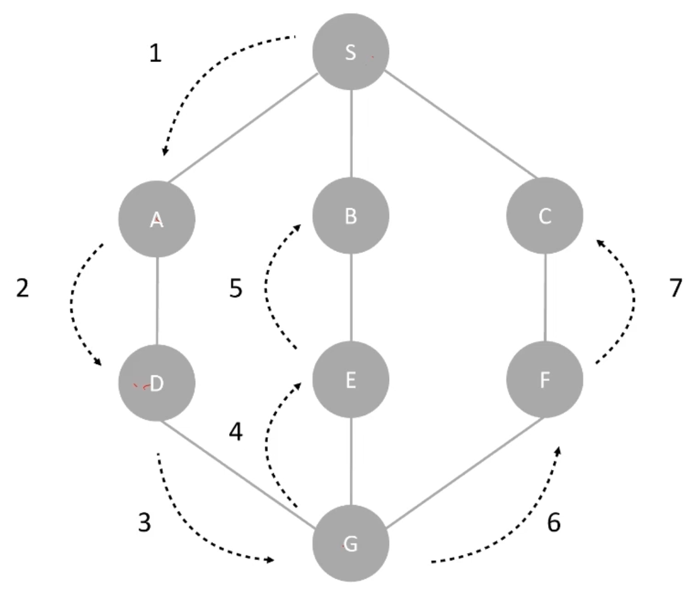
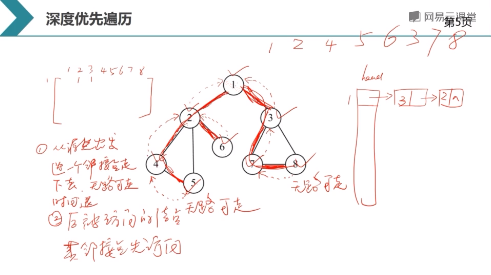

# 图

## 基环树

向一棵树添加一条边，就形成了一个环。此时整个结构被称为基环树(伪树、单环图)。

基环是指图中的一个环，且这个环中的所有边都是树边。


## 什么是图

图是由顶点的有穷非空集合和顶点之间边的集合组成，通常表示为：G(V,E)，其中，G表示一个图，V是图G中顶点的集合，E是图G中边的集合。

链表是特殊的树，树是特殊的图。

N 个点 N-1 条边的连通无向图是树。
N 个点 N 条边的连通无向图是基环树。

什么叫连通图？任意两个顶点之间都有路径。

## 图的存储



1、邻接矩阵



2、邻接表



3、出边数组



## 边集数组

边集数组表示法，通过数组存储每条边的起点和终点。如果是网，则增加一个权值域。

网的边集数组数据结构定义如下：

```ts
struct Edge {
  int u, v, w;
}e(N*N) // 每个点最多有 N-1 条边
```



如果 u 和 v 不是 int 类型，可以将 u 和 v 替换为索引。如 `a -> 0, b -> 1, c -> 2, d -> 3, e -> 4`。

边集数组存储如下：

| 边数组 | u   | v   | w   |
| ------ | --- | --- | --- |
| 0      | 0   | 1   | 2   |
| 1      | 0   | 2   | 5   |
| 2      | 1   | 2   | 2   |
| 3      | 1   | 3   | 6   |
| 4      | 2   | 3   | 7   |
| 5      | 2   | 4   | 1   |
| 6      | 3   | 2   | 2   |
| 7      | 3   | 4   | 4   |

找某条边的顶点或权重：

```
E[2].u
E[2].v
E[2].w
```

优点：
- 可以对边按照权值进行排序
- 方便对边进行处理

缺点：
- 不便于判断两个点之间是否有边
- 不便于遍历所有的邻接点
- 不便于求某个点的入度和出度
## 图的遍历

深度优先遍历




