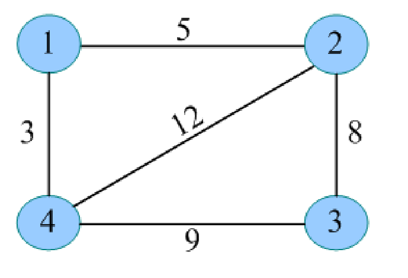

# 图

## 基环树

向一棵树添加一条边，就形成了一个环。此时整个结构被称为基环树(伪树、单环图)。

基环是指图中的一个环，且这个环中的所有边都是树边。


## 什么是图

图是由顶点的有穷非空集合和顶点之间边的集合组成，通常表示为：G(V,E)，其中，G表示一个图，V是图G中顶点的集合，E是图G中边的集合。

链表是特殊的树，树是特殊的图。

N 个点 N-1 条边的连通无向图是树。
N 个点 N 条边的连通无向图是基环树。

什么叫连通图？任意两个顶点之间都有路径。

## 图的存储


1、邻接矩阵


2、邻接表


3、出边数组


## 边集数组

边集数组表示法，通过数组存储每条边的起点和终点。如果是网，则增加一个权值域。

网的边集数组数据结构定义如下：

```ts
struct Edge {
  int u, v, w;
}e(N*N) // 每个点最多有 N-1 条边
```


如果 u 和 v 不是 int 类型，可以将 u 和 v 替换为索引。如 `a -> 0, b -> 1, c -> 2, d -> 3, e -> 4`。

边集数组存储如下：

| 边数组 | u   | v   | w   |
| ------ | --- | --- | --- |
| 0      | 0   | 1   | 2   |
| 1      | 0   | 2   | 5   |
| 2      | 1   | 2   | 2   |
| 3      | 1   | 3   | 6   |
| 4      | 2   | 3   | 7   |
| 5      | 2   | 4   | 1   |
| 6      | 3   | 2   | 2   |
| 7      | 3   | 4   | 4   |

找某条边的顶点或权重：

```
E[2].u
E[2].v
E[2].w
```

优点：
- 可以对边按照权值进行排序
- 方便对边进行处理

缺点：
- 不便于判断两个点之间是否有边
- 不便于遍历所有的邻接点
- 不便于求某个点的入度和出度

## 链式前向星

### 概念

链式前向星是邻接表的一种改进一静态链表存储，它用边集数组和邻接表相结合，可以快速找到某个点的所有邻接点。

链式前向星的数据结构定义如下：

```
边集数组 edge[i]  // 存储索引为 i 的边
头结点数组 head[i]  // 存储以 i 为起点的第一条边的下标(在 edge[] 中的下标)
```

```
// 边集数组
struct node {
  int to;  // 终点编号
  int w;  // 该边的权重
  int next;  // 该边的下一条边的下标
}edge(M)  // M 为边的数量
// 头结点数组
int head[N]  // N 为点的数量
```




### 时间复杂度

- 访问一个节点 v 的所有邻接点的时间复杂度为 O(degree(v))
- 访问所有节点的邻接点 O(N + E)


### 如何访问节点 v 的所有邻接点？

```ts
for (let i = head[v]; i != -1; i = edge[i].next) {
  // edge[i].to 为节点 v 的邻接点
  // edge[i].w 为节点 v 到节点 edge[i].to 的权重
  // edge[i].next 为节点 v 的下一条边的下标
}
```

### 添加边

```ts
function addEdge(u, v, w) {
  edge[cnt].to = v; // 终点编号
  edge[cnt].w = w; // 权重
  edge[cnt].next = head[u]; // 该边的下一条边的下标
  head[u] = cnt; // 以 u 为起点的第一条边的下标
  cnt++;
}
```


(头插法)

对于无向图, 需要 addEdge(u, v, w) 和 addEdge(v, u, w) 两次。对于有向图，只需要 addEdge(u, v, w) 一次。

注意：

- 初始化 head 数组为 -1，表示该点没有边。
- 为了方便，可以将 head 数组的下标从 1 开始，这样就不需要 -1 了。也就是节点的编号从 1 开始。
- 边集数组从索引 0 开始的好处是，方便查找互补边。如 `3^1 -> 4`，`4^1 -> 3`。

## 图的遍历

深度优先遍历


