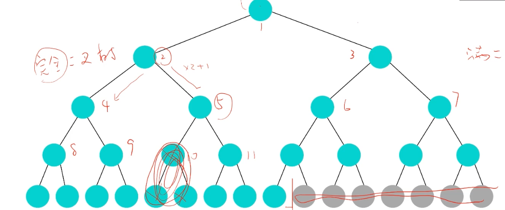
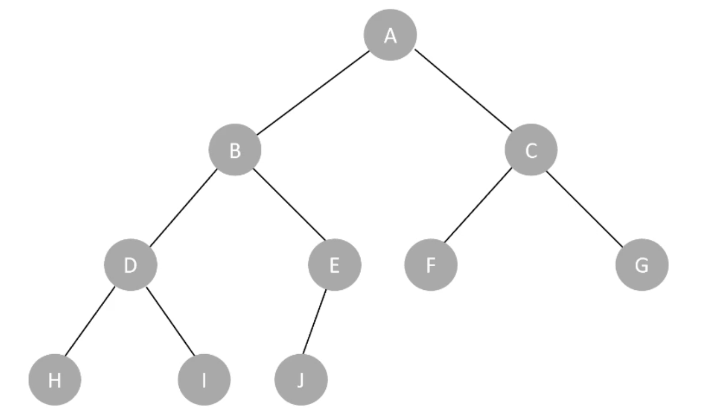
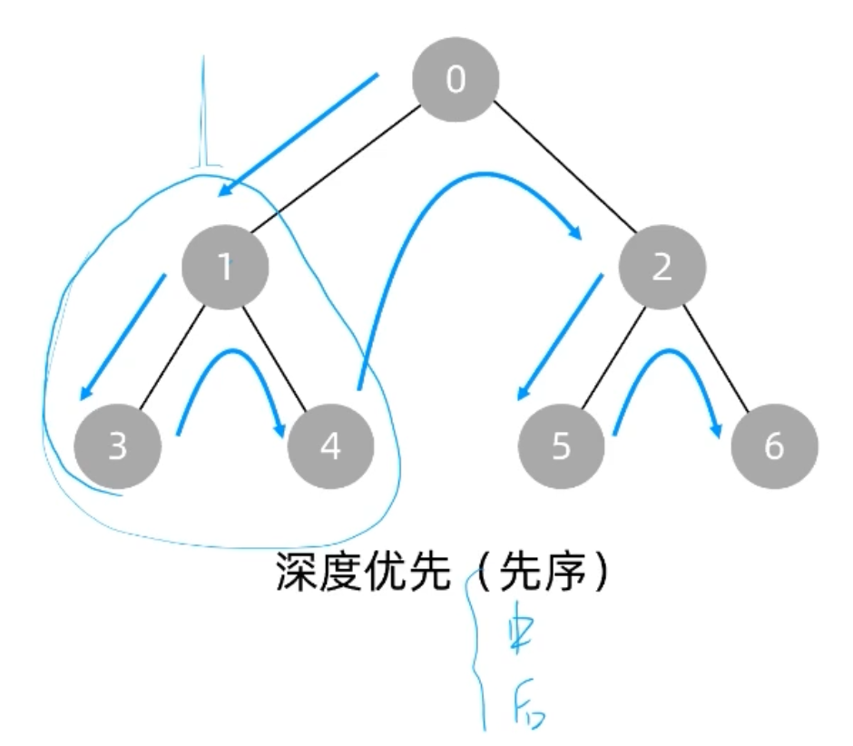
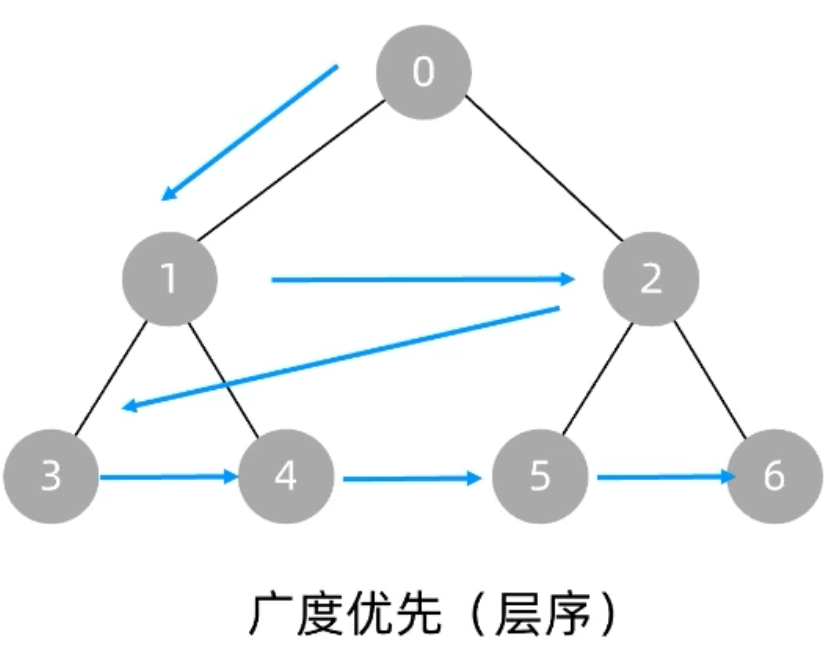
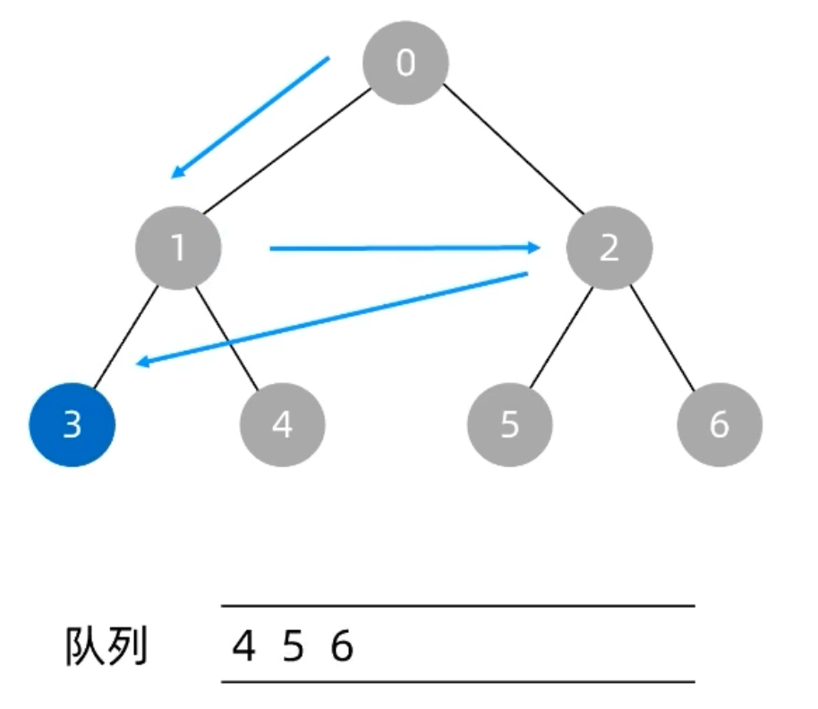

# 树

## 树的概念

- 深度: 根节点到叶子节点的最长路径，从0开始
- 高度: 叶子节点到根节点的最长路径，从0开始
- 节点的度：节点的子树个数, 0度为叶子节点
- 层次：根节点为第一层，根节点的子节点为第二层，以此类推

## 树的种类

- 二叉树
- 满二叉树
- 完全二叉树



## 二叉树的性质

- 非空二叉树第i层上的节点数最多为2^(i-1)
- 深度为k的二叉树至多有2^k-1个节点
- 完全二叉树，父节点i，左子节点2i，右子节点2i+1

## 二叉树遍历




### 深度优先遍历

遍历时，先往下遍历，遍历到最后一个节点，再往上遍历。



递归遍历，递归只想一层。

- 前序遍历 Pre-order：根 左子树 右子树
  - A BDHIEJ CFG
- 中序遍历 In-order：左子树 根 右子树
  - HDIBJE A FCG
- 后序遍历 Post-order：左子树 右子树 根
  - HIDJEB FGC A

### 广度优先遍历

- 层遍历，借助队列
  - A BC DEFG HIJ





## 实战题目

- [二叉树的中序遍历](https://leetcode.com/problems/binary-tree-inorder-traversal/)
- [N叉树的前序遍历](https://leetcode.com/problems/n-ary-tree-preorder-traversal/description/)
- [N叉树的层序遍历](https://leetcode.com/problems/n-ary-tree-level-order-traversal/)
- [二叉树的序列化与反序列化](https://leetcode.com/problems/serialize-and-deserialize-binary-tree/)

### 二叉树中序遍历

```js
/**
 * Definition for a binary tree node.
 * function TreeNode(val, left, right) {
 *     this.val = (val===undefined ? 0 : val)
 *     this.left = (left===undefined ? null : left)
 *     this.right = (right===undefined ? null : right)
 * }
 */
/**
 * @param {TreeNode} root
 * @return {number[]}
 */
// 迭代
var inorderTraversal = function(root) {
    const res = []

    const q = []

    while(root || q.length) {
        if(root) {
            q.push(root)
            root = root.left
        }else {
            const t = q.pop()
            res.push(t.val)
            root = t.right
        }
    }
    return res
};


// 递归
var inorderTraversal = function(root) {
    const res = []

    inorder(root, res)
    return res
};
function inorder(root, res){
    if(root == null) return
    inorder(root.left, res)
    res.push(root.val)
    inorder(root.right, res)
}
```
