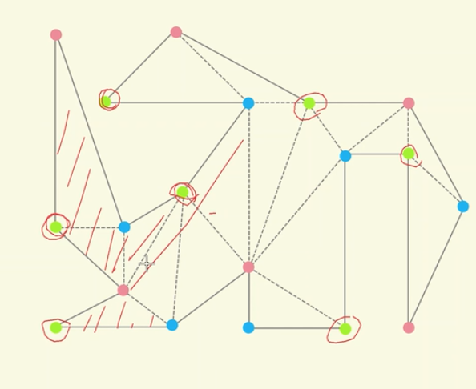

# 几何寻路

## 步骤

1. 单调多边形拆分：对多边形进行拆分。
2. 三角拆分：将单调多边形拆分为三角形。
3. 对偶图+BFS: 找到经过的三角形
4. 利用漏斗算法找到最短路径

## 单调多边形拆分

1. 多边形最高点、最低点
2. 单调性：一直增长或减少，如 y = x，一直递增

如上图，需要符合：

- 从 topmost -> bottommost 经过的节点 y 值要一直减少
- 从 bottommost -> topmost 经过的节点 y 值要一直增加

下面这个图里是单调多边形：

**如何判断一个多边形是否是单调的?**

- 方法2: 如判断 y 值一直减少。
- 方法1:画一条水平横线，与多边形最多有两个交点。（不过有可能交点是一条线段，如正方形）

上面这个多边形显然不是单调的，因为有 4 个交点的情况。

### 五种顶点类型

单调多边形顶点分为  5 种，regular vertex 算作一种。

这里的角度，是多边形形成的内角。是顺时针的。

**多边形拆成单调多边形的方法**

方法：消除多边形里的 split vertext 和 merge vertext。

为什么没有 split vertext 和 merge vertext 就是单调的？

利用反证法：如果有 split vertext 或 merge vertext，它和水平线会有 3 个交点。

**如何消除?**

需要满足两个条件:

1. 连线不能在多边形外部
2. 连线不能相交

比如上图：

- CH 连接后，有一部分在多边形外面，所以不能连接
- 如果 OG 相连后， CI 不能再相连，因为会相交

## 三角拆分

### 艺术画廊问题

艺术馆最少需要多少个摄像头进行监控，不留死角。

简单多边形：

- 不能有空洞
- 不能有自交点

最小摄像头时一个 NP-hard 很难，所以简化求次优解。

解决方法：因为三角形是可以用一个摄像头监控的，所以将一个多边形拆成若干个三角形，求次优解。

**定理一**
任何简单多边形都存在(至少)一个三角剖分;若其顶点数目为 n，则它的每个三角剖分都恰好包 含 n - 2 个三角形。

n 个点的多边形，拆分成 m1 + m2 个多边形，节点关系 m1 + m2 = n + 2

证明:

1. n = 3 => true
2. 假设 m < n，那么 m 个顶点可以生成 m - 2 个三角形。
3. 顶点数关系：m1 + m2 = n + 2
4. 将上面顶点转换为三角形 (m1 - 2) + (m2 - 2) = n -2

所以把摄像头放在三角形里，需要 n - 2 个摄像头可以实现全覆盖。

如果将摄像头放在拆分边上，那么只需要更少的三角形，放在边上，一个摄像头至少可以覆盖两个三角形。

如果把摄像头放在顶点上，那么它最多可以覆盖四个三角形，上界是多少。

如果放在顶点上，那么依次一个三角形染色完后，另一个相邻三角形只有一个顶点需要染色，而且颜色是固定的。

最后将摄像头放在相同颜色的顶点上，每个颜色平均能染 n/3 个顶点。

n%3 可能不能整除，利用鸽巢原理。 n%3 = 1 或 2 至少有一个巢要少一个格子。

**定理二**

- 美术馆定理：包含 n 个顶点的任何简单多边形，只需(放置在适当位置的) Math.floor(n/3) 台摄像机就能保证，其中任何一点都可见于至少一台摄像机。

**对偶图**

对于简单多边形，将每个三角形进行染色，把每个三角形看作一个点，进行连接染色。点会连接成一个对偶图，没有环的图就是 Tree，可以用 bfs、dfs 进行搜索。

复杂多边形，如有空的，点连接后可能会有环。

### 三角拆分算法

## 对偶图和 BFS

- DCEL 生成对偶图。
- BFS 查找最短路径

## 漏斗算法

### 什么是漏斗算法

apex 漏斗的顶点，left 漏斗的左边界，right 漏斗的右边界。

如果导航边使漏斗变小，就更新左边界，使漏斗变大，就不更新。

- 每次处理一条导航边，直到处理完所有的导航边。
- 如果新的顶点与 apex 形成的漏斗比原来的小，那么我们将对应左顶点或右顶点移动到该位置处；反之，则不做更新，因为新漏斗变大了;
- 如果新的一侧顶点与 apex 形成的边界，越过了另一侧原顶点与 apex 形成的边界，我们将apex移动到该位置处，并将apex加入到最短路径中;
- 最后将起点和终点分别添加到最短路径中，形成的路径点连线即为最短路径。

### 如何判断漏斗的大小

使用 toLeft 测试(左转)。toLeft 为 true 表示为 +，为 false 表示为 -。

上面两条有向线段将平面分为了 ABCD 四个部分。

- 如果点位于 A 它对于两条边的 toLeft 分别为 -+。
- 如果点位于 B 它对于两条边的 toLeft 分别为 ++。
- 如果点位于 C 它对于两条边的 toLeft 分别为 +-。
- 如果点位于 D 它对于两条边的 toLeft 分别为 --。

可以看到，漏斗变小时，针对两条边的 toLeft 测试一定不相同。

### 左右顶点

导航边连接的两个点类型一定是相反的(left/right)。

上图数组中，将起点和终点也作为导航边 Left 和 Right 处理，会引入问题：

- apex 和左右顶点共点
- apex 和左顶点共点
- apex 和右顶点共点

上面三种情况，都是只需要更新漏斗，不需要更新 apex。

## DCEL

