# 计算几何

计算几何研究的是

## 凸包问题

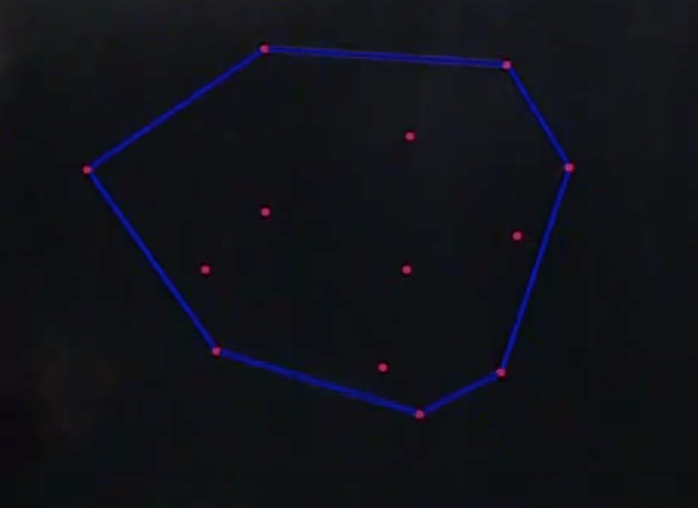

这个外围形状就是凸包。内部的钉子不起作用，但是如果内部钉子往外移动，可能造成外面有些钉子不再起作用。

比如 rgb 颜料勾兑，两种颜料勾兑，颜色分布在两点连线上，三种颜色勾兑，分布在三角形内。

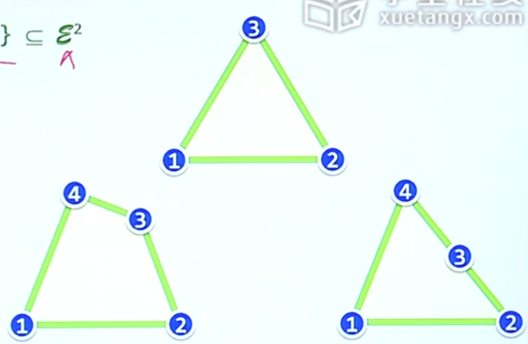

转化

大事化小、小事化了，不断的规约，找到问题的本质，可能没有什么需要做的。

## 极点算法

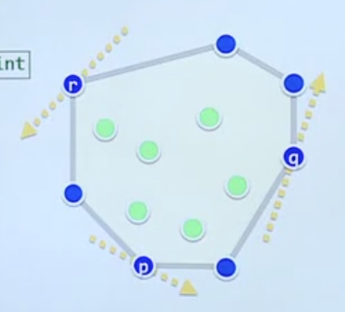

起作用的点(外围的点)，有一个特性，可以找到一个点，让所有的点都分布在它的一侧。或者说一侧是空的。这些保留下来的点(外围点)叫做极点。

如何区别极点和非极点。
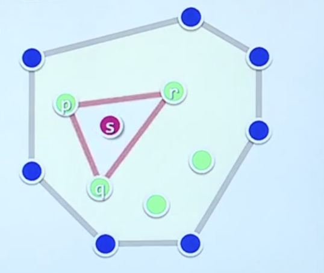

判断一个点是否在其他三个点形成的三角形内部。

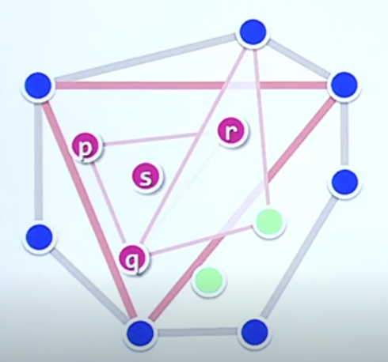

In-Triangle Test
算法

- 假设所有点都是极点
- 枚举所有的三角形
- 判断点是否在三角形内

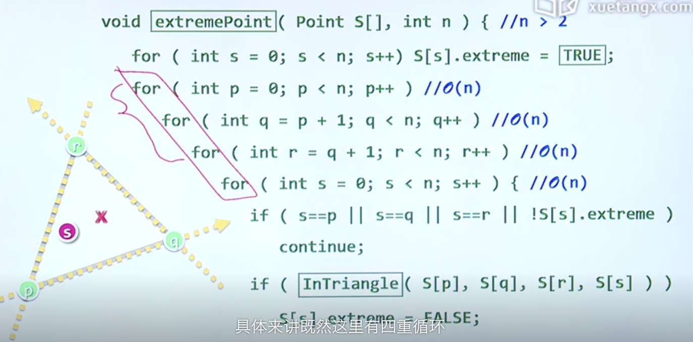

上面算法复杂度太高 O(n^4)。

To-Left Test

如果一个点在三角形内，则可以通过 To-Left 测试。
每条直线都可以将平面分为两侧。
即相对于这三角形的每条边形成的有向直线，这个点都在左侧。

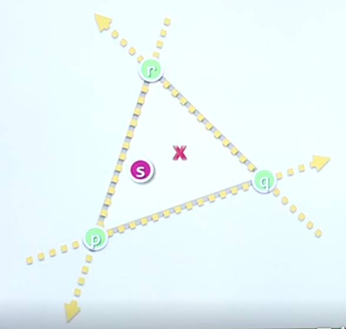

三条直线将平面分成最多 7 块。但是每条边分为 left 和 right 2 种，有 2 ^ 3 = 8 种，少了 1 块。

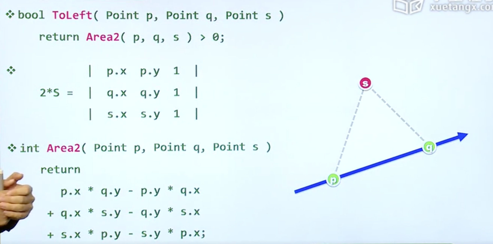

- 面积是两倍面积（行列式），海伦公式（给三个点，可以得到面积）
- 上面算的面积是有向面积。沿着边方向形成的面积。
- 好处：消除了除法和三角函数，避免误差。

## 极边算法

对凸包有贡献的边，就是极边。如果是极边，所有的点都在它的左侧。

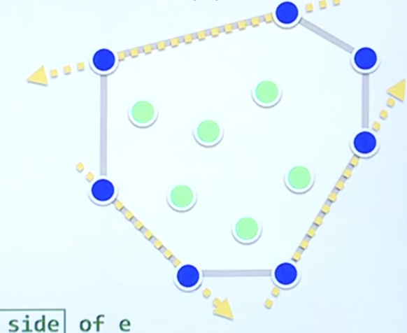

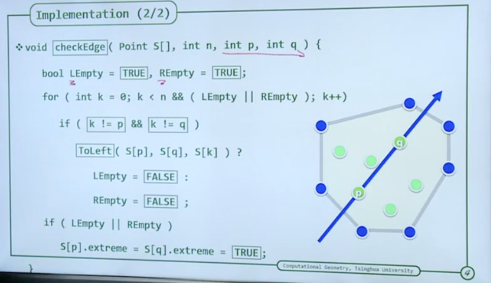
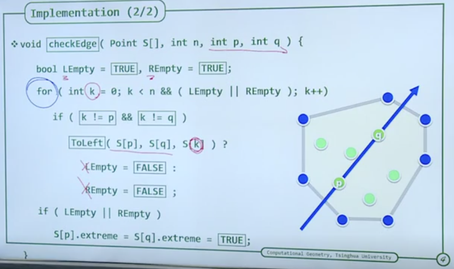

算法复杂度 O(n^3)

## 减而治之
